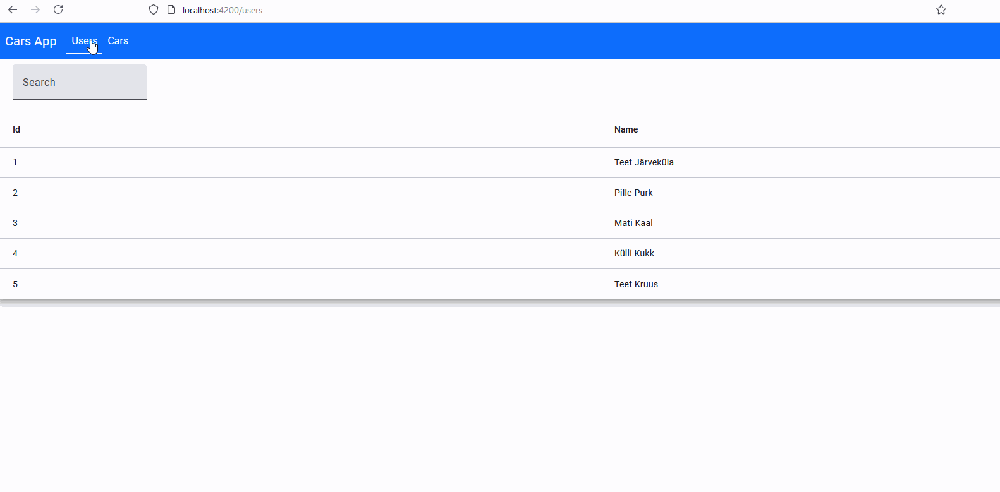

## Car App

App to query information about  users and their cars.

Search and sort functionality implemented on Angular frontend for `/users` and `/cars` endpoints.

App has built-in UI navigation.

Frontend is build with Angular 18 and uses Material design.

Data is read-only. Data is stored in H2 in-memory database.

Automated test for happy flow and with invalid inputs test
are implemented for backend with JUnit on Service and Controller layer.

Code is production ready:

1. Health endpoint Spring Boot Actuator: `/actuator/health`

2. Prod config with CORS off

3. Production profile

## Demo

## Frontend

### How to install and run frontend

### Step 1:

`cd .\webapp\`

### Step 2:

#### Option 1:

Run directly:

`npx @angular/cli serve`

#### Option 2: 

Install Angular CLI

`npm install -g @angular/cli`

Run

`ng serve`

## Backend
http://localhost:8080

### Swagger API spec

http://localhost:8080/swagger-ui/index.html

#### Endpoints

GET `/users`

GET `/users/1`

GET `/users/1/cars`

GET `/cars`

GET `/cars/1`

### How to run backend:

Dev profile:

`./gradlew bootRun`

Prod profile:

`./gradlew bootRun --args='--spring.profiles.active=prod`

## Technologies used

- Java 21
- Spring Boot 3
- Spring Data JPA
- Hibernate
- JUnit
- Gradle
- Node.js 20
- Angular 18
- TypeScript
- Material design